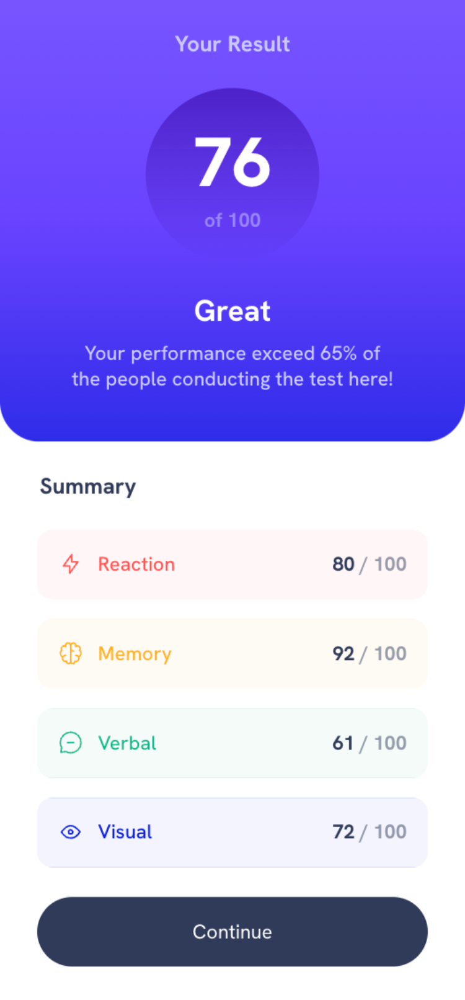
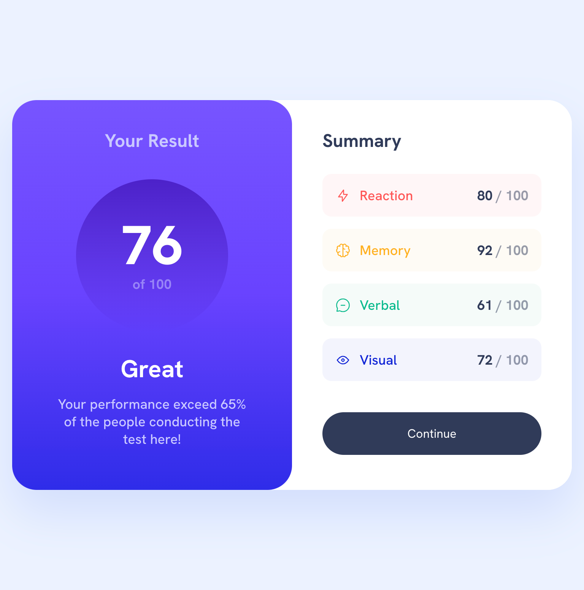
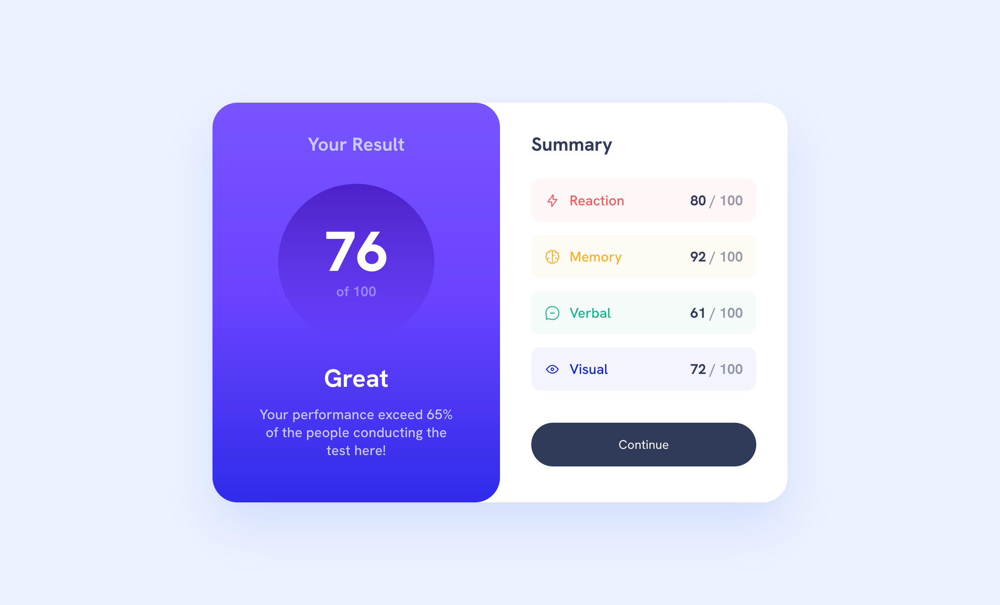

# Frontend Mentor - Results summary component solution

This is a solution to the [Results summary component challenge on Frontend Mentor](https://www.frontendmentor.io/challenges/results-summary-component-CE_K6s0maV).

## Table of contents

- [Overview](#overview)
  - [The challenge](#the-challenge)
  - [Screenshot](#screenshot)
  - [Links](#links)
- [Built with](#built-with)
- [Author](#author)

## Overview

### The challenge

Users should be able to:

- ✅ View the optimal layout for the interface depending on their device's screen size
- ✅ See hover and focus states for all interactive elements on the page
- 🚧 **Bonus**: Use the local JSON data to dynamically populate the content

### Screenshot

| Mobile Preview                | Tablet Preview                | Desktop Preview                |
| ----------------------------- | ----------------------------- | ------------------------------ |
|  |  |  |

### Links

- Solution URL: [Frontend Mentor ↗](https://your-solution-url.com)
- Live Site URL: [Open on Vercel ↗](https://your-live-site-url.com)

## Built with

### Key Features

- 📱 Semantic HTML5 markup with proper ARIA attributes
- 🎨 Mobile-first responsive design
- 🔍 Proper SEO setup with metadata
